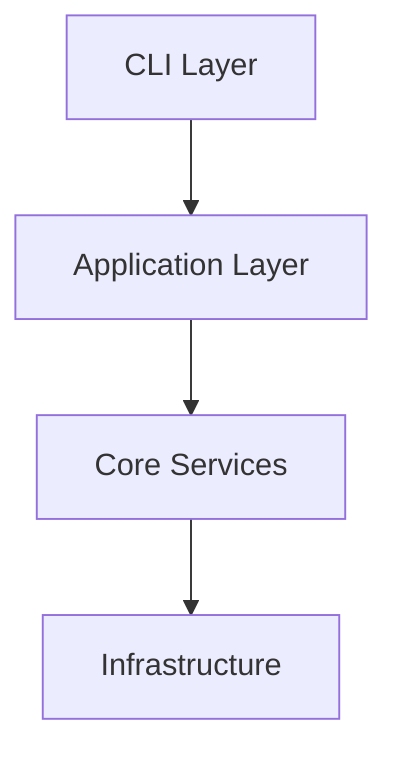

# Documentation Guidelines

This document defines the documentation standards and practices for the Goldentooth Agent project.

## Documentation Philosophy

### Core Principles
- **Documentation as code**: Documentation lives with code and evolves together
- **User-focused**: Write for the reader, not the writer
- **Maintain accuracy**: Keep documentation in sync with implementation
- **Progressive disclosure**: Start simple, provide depth when needed
- **Searchable and navigable**: Structure for easy discovery

### Documentation Types
1. **API Documentation**: Function/method signatures, parameters, return values
2. **Module Documentation**: README files explaining module purpose and structure
3. **Architecture Documentation**: High-level system design and patterns
4. **User Documentation**: How to use the system (CLI, agents, workflows)
5. **Developer Documentation**: Contributing, setup, development workflow
6. **Debugging Documentation**: Error scenarios, troubleshooting, common issues

## Module Documentation Standards

### README.md Requirements
**ENFORCED RULE**: Every Python module or submodule should have a comprehensive README.md describing the contents of the module, usage examples, key components, dependencies, file count, lines-of-code and other statistics, test coverage statistics, etc. This file should be updated for accuracy whenever a Python file contained in the module is touched. The README.md must always contain a full specification of the public API.

Every module directory must contain a comprehensive README.md file with the following sections:

```markdown
# Module Name

Brief description of the module's purpose and primary responsibilities.

## Overview

Detailed explanation of what this module does, its role in the larger system,
and key concepts or patterns it implements.

## Architecture

High-level architecture diagram or description showing:
- Key components and their relationships
- Data flow patterns
- Integration points with other modules

## Key Components

### ComponentName
Description of the component, its responsibilities, and usage patterns.

```python
# Example usage
component = ComponentName(config)
result = component.process(data)
```

### AnotherComponent
...

## API Reference

### Public Functions

#### function_name(param1: Type, param2: Type) -> ReturnType
Description of what the function does.

**Parameters:**
- `param1`: Description of parameter
- `param2`: Description of parameter

**Returns:**
- Description of return value

**Raises:**
- `ExceptionType`: When this exception occurs

**Example:**
```python
result = function_name("value", 42)
```

### Classes

#### ClassName
Description of the class and its purpose.

**Methods:**
- `method_name()`: Brief description
- `another_method()`: Brief description

## Configuration

Description of any configuration options, environment variables, or settings.

```python
# Configuration example
config = {
    "setting1": "value",
    "setting2": 42
}
```

## Examples

Practical examples showing common usage patterns:

```python
# Basic usage
from goldentooth_agent.module import Component

component = Component()
result = component.process_data(input_data)
```

```python
# Advanced usage with configuration
component = Component(config={
    "advanced_option": True,
    "timeout": 30.0
})
```

## Testing

Information about testing the module:
- How to run tests
- Test data requirements
- Mock setup for dependencies

```bash
# Run module tests
poetry run pytest tests/module_name/

# Run specific test
poetry run pytest tests/module_name/test_component.py
```

## Dependencies

List of dependencies (both internal and external):

**Internal Dependencies:**
- `goldentooth_agent.core.context`: Context management
- `goldentooth_agent.core.flow`: Flow composition

**External Dependencies:**
- `anthropic`: Claude API client
- `numpy`: Numerical computations

## Performance Considerations

Performance characteristics and optimization notes:
- Expected performance benchmarks
- Memory usage patterns
- Scaling considerations
- Known bottlenecks

## Known Issues and Limitations

Current limitations and planned improvements:
- Issue descriptions
- Workarounds if available
- Plans for resolution

## Statistics

Automatically generated or manually maintained statistics:
- File count: X files
- Lines of code: ~X LOC
- Test coverage: X%
- Public API surface: X functions/classes

## Changelog

Recent significant changes to the module:
- Version/Date: Description of changes
- Version/Date: Description of changes

### Module README Update Requirements
- **Update trigger**: Any significant change to a Python file in the module
- **Content accuracy**: Ensure all information reflects current implementation
- **API completeness**: Document all public functions, classes, and methods
- **Example validity**: Verify all code examples work with current implementation

### Module Metadata Requirements (README.meta.yaml)

**AUTOMATED MANAGEMENT**: README.meta.yaml files are automatically generated and maintained by pre-commit hooks. Module metadata (symbols, dependencies, metrics) is kept current without manual intervention.

Every Python module/submodule must include a `README.meta.yaml` file providing structured metadata for organization and symbol tracking. This ensures no symbol is defined in multiple places and provides quick module overview.

#### Required Structure
```yaml
module_name: Flow Engine Core
complexity: Low  # Low, Medium, High, Critical
file_count: 4
loc: ~400  # Approximate lines of code
test_coverage: High  # Low, Medium, High
class_count: 4
function_count: 16
coverage_target: 95%+
test_perf: All tests <100ms

internal_dependencies:
  - goldentooth_agent.flow_engine.protocols
  - goldentooth_agent.flow_engine.extensions

external_dependencies:
  - typing
  - collections.abc
  - asyncio

symbols:
  - Flow
  - FlowError
  - FlowValidationError
  - FlowFactory
  # List all top-level symbols (classes, functions, constants, types)
  # defined in this module to ensure uniqueness across codebase

exports:
  - Flow
  - FlowError
  - FlowValidationError
  - FlowExecutionError
  - FlowTimeoutError
  - FlowConfigurationError
  - FlowFactory
  # List all symbols exported from this module's __init__.py
```

#### Field Definitions

**Basic Metadata:**
- `module_name`: Human-readable module name
- `complexity`: Development complexity (Low, Medium, High, Critical)
- `file_count`: Number of Python files in the module
- `loc`: Approximate lines of code (use ~ prefix for estimates)
- `test_coverage`: Current test coverage level (Low <70%, Medium 70-85%, High >85%)
- `class_count`: Number of classes defined in the module
- `function_count`: Number of top-level functions in the module
- `coverage_target`: Target test coverage percentage
- `test_perf`: Performance requirement for tests

**Dependencies:**
- `internal_dependencies`: Other project modules this module depends on
- `external_dependencies`: External packages/libraries used

**Symbol Tracking:**
- `symbols`: All top-level symbols defined in this module (classes, functions, constants, type aliases)
- `exports`: Symbols exported through the module's `__init__.py`

#### Example for Different Module Types

**Core Service Module:**
```yaml
module_name: RAG Service
complexity: High
file_count: 6
loc: ~3200
test_coverage: High
class_count: 8
function_count: 24
coverage_target: 90%+
test_perf: Most tests <500ms

internal_dependencies:
  - goldentooth_agent.core.embeddings
  - goldentooth_agent.core.document_store
  - goldentooth_agent.core.llm
  - goldentooth_agent.core.context

external_dependencies:
  - anthropic
  - numpy
  - asyncio
  - pydantic

symbols:
  - RAGService
  - QueryExpansionEngine
  - QueryExpansion
  - QueryIntent
  - SearchStrategy
  - ChunkFusion
  - RAGError
  - QueryExpansionError
  - DocumentNotFoundError

exports:
  - RAGService
  - QueryExpansionEngine
  - QueryExpansion
  - QueryIntent
  - SearchStrategy
  - ChunkFusion
  - RAGError
```

**Utility Module:**
```yaml
module_name: Path Utilities
complexity: Low
file_count: 2
loc: ~150
test_coverage: High
class_count: 1
function_count: 8
coverage_target: 100%
test_perf: All tests <50ms

internal_dependencies: []

external_dependencies:
  - pathlib
  - os
  - typing

symbols:
  - Paths
  - ensure_directory
  - resolve_path
  - get_project_root
  - normalize_path

exports:
  - Paths
  - ensure_directory
  - resolve_path
```

**Flow Engine Module:**
```yaml
module_name: Flow Engine Combinators
complexity: Medium
file_count: 8
loc: ~2100
test_coverage: High
class_count: 2
function_count: 45
coverage_target: 95%+
test_perf: All tests <200ms

internal_dependencies:
  - goldentooth_agent.flow_engine.core
  - goldentooth_agent.flow_engine.protocols

external_dependencies:
  - typing
  - collections.abc
  - asyncio
  - functools

symbols:
  - map_stream
  - filter_stream
  - batch_stream
  - parallel_stream
  - merge_streams
  - throttle_stream
  - cache_stream
  - retry_stream
  - timeout_stream
  - distinct_stream
  - memoize_stream
  - route_stream
  - split_stream
  - aggregate_stream
  - window_stream

exports:
  - map_stream
  - filter_stream
  - batch_stream
  - parallel_stream
  - merge_streams
  - throttle_stream
  - cache_stream
  - retry_stream
  - timeout_stream
  - distinct_stream
  - memoize_stream
  - route_stream
  - split_stream
  - aggregate_stream
  - window_stream
```

#### Maintenance Requirements

**Update Triggers:**
- Any new symbol (class, function, constant) added to the module
- Changes to public API (exports)
- New dependencies added
- Significant changes to file count or LOC
- Coverage target changes

**Validation Rules:**
- All symbols in `exports` must exist in `symbols`
- Dependencies should be accurate and minimal
- Complexity should reflect actual development difficulty


**Automation Opportunities:**
```python
def validate_module_metadata(module_path: Path) -> list[str]:
    """Validate README.meta.yaml against actual module content."""
    errors = []

    meta_file = module_path / "README.meta.yaml"
    if not meta_file.exists():
        errors.append(f"Missing README.meta.yaml in {module_path}")
        return errors

    with open(meta_file) as f:
        metadata = yaml.safe_load(f)

    # Validate file count
    actual_files = len(list(module_path.glob("*.py")))
    declared_files = metadata.get("file_count", 0)
    if abs(actual_files - declared_files) > 1:
        errors.append(
            f"File count mismatch: declared {declared_files}, "
            f"actual {actual_files}"
        )

    # Validate symbols exist
    init_file = module_path / "__init__.py"
    if init_file.exists():
        # Parse __init__.py and verify exports
        # ... implementation

    return errors

```

This metadata system enables:
- **Dependency tracking**: Understand module relationships
- **Complexity assessment**: Identify modules needing attention
- **API surface documentation**: Track what each module exports
- **Automated validation**: Verify metadata accuracy against actual code

## Code Documentation Standards

### Function/Method Documentation
```python
def process_documents(
    documents: list[Document],
    config: ProcessingConfig | None = None,
    timeout: float = 30.0
) -> ProcessingResult:
    """Process a list of documents with optional configuration.

    This function processes documents using the configured strategy and
    returns a result containing processed documents and metadata.

    Args:
        documents: List of documents to process. Must not be empty.
        config: Optional processing configuration. Uses defaults if None.
        timeout: Maximum time to spend processing in seconds.

    Returns:
        ProcessingResult containing:
        - processed_documents: List of successfully processed documents
        - failed_documents: List of documents that failed processing
        - metadata: Processing statistics and timing information

    Raises:
        ValueError: If documents list is empty
        ProcessingError: If processing fails for all documents
        TimeoutError: If processing exceeds timeout

    Example:
        >>> docs = [Document(content="Hello"), Document(content="World")]
        >>> config = ProcessingConfig(strategy="fast")
        >>> result = process_documents(docs, config, timeout=60.0)
        >>> print(f"Processed {len(result.processed_documents)} documents")
        Processed 2 documents

    Note:
        This function is safe to call concurrently as it doesn't modify
        the input documents or maintain shared state.
    """
```

### Class Documentation
```python
class DocumentProcessor:
    """Processes documents using configurable strategies.

    The DocumentProcessor provides a high-level interface for document
    processing with support for multiple strategies, error recovery,
    and performance monitoring.

    This class is thread-safe and can be used concurrently from multiple
    coroutines. It maintains internal state for caching and optimization
    but doesn't modify input data.

    Attributes:
        strategy: Current processing strategy name
        config: Processing configuration
        stats: Processing statistics (read-only)

    Example:
        Basic usage:
        >>> processor = DocumentProcessor()
        >>> result = await processor.process(document)

        With custom configuration:
        >>> config = ProcessingConfig(strategy="accurate", timeout=60.0)
        >>> processor = DocumentProcessor(config)
        >>> results = await processor.process_batch(documents)

    See Also:
        ProcessingConfig: Configuration options
        ProcessingResult: Return value structure
        ProcessingStrategy: Available processing strategies
    """

    def __init__(
        self,
        config: ProcessingConfig | None = None,
        cache_size: int = 1000
    ) -> None:
        """Initialize the document processor.

        Args:
            config: Processing configuration. Uses defaults if None.
            cache_size: Maximum number of cached processing results.
                       Set to 0 to disable caching.
        """
```

### Inline Comments
```python
def complex_processing_function(data: InputData) -> OutputData:
    """Process complex data with multiple stages."""

    # Validate input data structure and content
    if not self._validate_input(data):
        raise ValueError("Invalid input data structure")

    # Apply preprocessing transformations
    # Note: Order matters here - normalization must come before tokenization
    normalized = self._normalize_data(data)
    tokenized = self._tokenize_data(normalized)

    # Main processing pipeline
    # Using parallel processing for performance on large datasets
    with ThreadPoolExecutor(max_workers=4) as executor:
        futures = [
            executor.submit(self._process_chunk, chunk)
            for chunk in self._chunk_data(tokenized)
        ]

        processed_chunks = [
            future.result() for future in as_completed(futures)
        ]

    # Combine results and apply post-processing
    combined = self._combine_chunks(processed_chunks)

    # Final validation before returning
    if not self._validate_output(combined):
        logger.warning("Output validation failed, using fallback")
        return self._fallback_processing(data)

    return combined
```

## API Documentation Standards

### Public API Documentation
All public APIs must be documented with:
- Clear purpose description
- Complete parameter documentation
- Return value specification
- Exception documentation
- Usage examples
- Performance characteristics (if relevant)

### Internal API Documentation
Internal APIs should have:
- Brief purpose description
- Parameter types and meanings
- Any side effects or state changes
- Relationships to other internal components

### Protocol Documentation
```python
from typing import Protocol

class DocumentStore(Protocol):
    """Protocol for document storage implementations.

    This protocol defines the interface that all document store
    implementations must provide. It supports both synchronous
    and asynchronous operations for maximum flexibility.

    Implementations should be thread-safe and handle concurrent
    access gracefully.

    Example implementations:
    - FileDocumentStore: File-based storage
    - DatabaseDocumentStore: Database-backed storage
    - MemoryDocumentStore: In-memory storage for testing
    """

    def store_document(self, document: Document) -> None:
        """Store a document in the store.

        Args:
            document: Document to store. Must have valid ID.

        Raises:
            DocumentExistsError: If document with same ID exists
            StorageError: If storage operation fails
        """
        ...

    def get_document(self, document_id: str) -> Document | None:
        """Retrieve a document by ID.

        Args:
            document_id: Unique identifier for the document

        Returns:
            Document if found, None otherwise

        Raises:
            StorageError: If retrieval operation fails
        """
        ...
```

## Architecture Documentation

### System Architecture Documentation
```markdown
# System Architecture

## Overview
High-level description of the system architecture, key design decisions,
and architectural patterns used.

## Core Components

### Component Diagram


### Data Flow
Description of how data flows through the system:

1. **Input**: User request via CLI
2. **Processing**: Request routing and agent selection
3. **Execution**: Agent processes request using core services
4. **Output**: Response returned to user

## Design Patterns

### Dependency Injection
The system uses Antidote for dependency injection to:
- Manage component lifecycle
- Enable testing with mocks
- Support configuration injection

### Flow-Based Architecture
Processing is implemented using composable flows:
- Immutable data processing
- Async generators for streaming
- Type-safe composition

## Integration Points

### External Systems
- **Claude API**: LLM interactions
- **Vector Database**: Semantic search
- **File System**: Document storage

### Internal Modules
- **Context System**: Shared state management
- **Event System**: Cross-component communication
- **Background Processing**: Async task execution

## Quality Attributes

### Performance
- Target response times for operations
- Scalability characteristics
- Resource usage patterns

### Reliability
- Error handling strategies
- Failure recovery mechanisms
- Data consistency guarantees

### Security
- Input validation approach
- Authentication/authorization
- Secret management
```

## User Documentation

### CLI Documentation
```markdown
# CLI Reference

## Overview
The Goldentooth Agent CLI provides access to AI-powered document
processing and chat capabilities.

## Installation
```bash
pip install goldentooth-agent
```

## Quick Start
```bash
# Interactive chat with default agent
goldentooth-agent chat

# RAG-powered document chat
goldentooth-agent chat --agent rag

# Single message mode
goldentooth-agent send "What is the project about?" --agent rag
```

## Commands

### chat
Start an interactive chat session.

**Usage:**
```bash
goldentooth-agent chat [OPTIONS]
```

**Options:**
- `--agent TEXT`: Agent type to use (default: "simple")
- `--config PATH`: Path to configuration file
- `--debug`: Enable debug logging

**Examples:**
```bash
# Use RAG agent for document-aware chat
goldentooth-agent chat --agent rag

# Chat with debug logging
goldentooth-agent chat --debug
```

### send
Send a single message and get response.

**Usage:**
```bash
goldentooth-agent send MESSAGE [OPTIONS]
```

**Arguments:**
- `MESSAGE`: Message to send to the agent

**Options:**
- `--agent TEXT`: Agent type to use
- `--output FORMAT`: Output format (text, json)

**Examples:**
```bash
# Send single message
goldentooth-agent send "Explain the architecture"

# Get JSON response
goldentooth-agent send "List features" --output json
```

## Configuration

### Configuration File
Create a `.goldentooth.yaml` file:

```yaml
agents:
  default: "rag"

rag:
  max_results: 10
  similarity_threshold: 0.1

llm:
  model: "claude-3-sonnet-20240229"
  max_tokens: 2000
```

### Environment Variables
- `ANTHROPIC_API_KEY`: Claude API key (required)
- `GOLDENTOOTH_CONFIG`: Path to configuration file
- `GOLDENTOOTH_DATA_DIR`: Data directory path
```

## Development Documentation

### Contributing Guide
```markdown
# Contributing to Goldentooth Agent

## Development Setup
1. Clone the repository
2. Install dependencies: `poetry install`
3. Set up pre-commit hooks: `pre-commit install`

## Development Workflow
1. Create feature branch
2. Write tests first (TDD)
3. Implement functionality
4. Update documentation
5. Run quality checks
6. Submit pull request

## Quality Standards
- Test coverage ≥ 85%
- All type checks pass
- Documentation is updated
- Performance requirements met

## Testing
```bash
# Run all tests
poetry run poe test

# Run specific test suite
poetry run pytest tests/core/

# Run with coverage
poetry run poe test-cov
```

## Code Review Checklist
- [ ] Tests cover new functionality
- [ ] Documentation is updated
- [ ] Type annotations are complete
- [ ] Performance is acceptable
- [ ] Error handling is appropriate
```

## Documentation Maintenance

### Automated Documentation
```python
def update_module_statistics(module_path: Path) -> dict[str, Any]:
    """Update module statistics in README."""
    stats = {
        "file_count": len(list(module_path.glob("*.py"))),
        "line_count": count_lines_of_code(module_path),
        "test_coverage": get_test_coverage(module_path),
        "public_api_count": count_public_api_elements(module_path)
    }
    return stats

def validate_documentation_examples():
    """Validate that documentation examples work."""
    # Extract and execute code examples from docstrings
    # Report any that fail to execute correctly
    pass
```

### Documentation Review Process
1. **Automated checks**: Verify examples execute correctly
2. **Accuracy review**: Ensure information matches implementation
3. **Clarity review**: Check for user-friendly language
4. **Completeness review**: Verify all public APIs are documented
5. **Link validation**: Check all internal/external links work

### Documentation Tools
- **Sphinx**: For comprehensive documentation sites
- **mkdocs**: For markdown-based documentation
- **docstring-parser**: For extracting API documentation
- **mermaid**: For diagrams and flowcharts
- **plantuml**: For complex architectural diagrams

## Debugging Documentation Standards

### Error Context Documentation Requirements

**All complex functions and public APIs must include debugging information in their docstrings:**

#### Required Debugging Sections
```python
def process_agent_response(response_data: Any, expected_format: str) -> ProcessedResponse:
    """Process agent response with comprehensive error documentation.

    Args:
        response_data: Raw response from agent (dict or object)
        expected_format: Expected response format ("dict" or "object")

    Returns:
        ProcessedResponse with validated data

    Raises:
        ValidationError: If response_data format is invalid
        AttributeError: If accessing response_data.attribute on dict object
        TypeError: If response_data is not dict or compatible object

    Common Issues:
        - **Dict vs Object Access**: If getting AttributeError, check if response_data
          is a dictionary. Use response_data["key"] instead of response_data.key
        - **Missing Fields**: Check response_data.keys() or dir(response_data) for
          available fields
        - **Type Mismatch**: Verify response_data type matches expected_format

    Debugging:
        - Print type(response_data) to check actual type
        - Use hasattr(response_data, 'attribute') to check for attributes
        - Check response_data.__dict__ for object contents
        - Validate with isinstance(response_data, dict) for dictionaries

    Example:
        >>> # Dictionary response
        >>> response = {"text": "hello", "confidence": 0.8}
        >>> result = process_agent_response(response, "dict")

        >>> # Object response
        >>> response = AgentResponse(text="hello", confidence=0.8)
        >>> result = process_agent_response(response, "object")

    See Also:
        - docs/debugging-improvements.md#dict-vs-object-access
        - guidelines/error-handling.md#enhanced-error-context
    """
```

#### Response Interface Documentation
```python
class AgentResponse(BaseModel):
    """Standard agent response schema with debugging guidance.

    This class prevents common dict/object access confusion by providing
    a consistent interface for all agent responses.

    Attributes:
        response: Main response text from the agent
        sources: List of source documents or references
        confidence: Confidence score (0.0 to 1.0)
        suggestions: List of follow-up suggestions for the user
        metadata: Additional processing metadata

    Common Usage Patterns:
        # ✅ Correct object access
        agent_response = AgentResponse(response="Hello")
        text = agent_response.response

        # ✅ Dictionary conversion when needed
        response_dict = agent_response.model_dump()
        text = response_dict["response"]

        # ❌ Common mistake: mixing patterns
        # Don't access .response on dictionaries
        # Don't access ["response"] on AgentResponse objects

    Migration Guide:
        If migrating from dictionary responses:

        # Old pattern (dict)
        result = {"response": "text", "confidence": 0.8}
        text = result["response"]

        # New pattern (object)
        result = AgentResponse(response="text", confidence=0.8)
        text = result.response

        # Migration helper
        result = AgentResponse.from_dict(legacy_dict_response)

    Troubleshooting:
        - AttributeError on .response: Check if you have a dict instead of AgentResponse
        - KeyError on ["response"]: Check if you have AgentResponse instead of dict
        - Type confusion: Use isinstance(obj, AgentResponse) to verify type

    See Also:
        - guidelines/code-style.md#response-handling-standards
        - src/goldentooth_agent/core/schema/README.md
    """
```

### Error Scenario Documentation

#### Function-Level Error Documentation
```python
def parse_llm_response(raw_response: str) -> dict[str, Any]:
    """Parse LLM response with error scenario documentation.

    Args:
        raw_response: Raw text response from LLM

    Returns:
        Parsed response dictionary

    Error Scenarios:
        1. **Invalid JSON**: If raw_response is not valid JSON
           - Symptom: JSONDecodeError raised
           - Cause: LLM returned malformed JSON or plain text
           - Solution: Check if response starts with '{' or validate format
           - Debug: Print raw_response[:100] to see actual content

        2. **Missing Required Fields**: If parsed JSON lacks expected keys
           - Symptom: KeyError when accessing result["field"]
           - Cause: LLM didn't include all required response fields
           - Solution: Use .get() with defaults or validate schema
           - Debug: Print list(parsed.keys()) to see available fields

        3. **Type Mismatch**: If field values have wrong types
           - Symptom: TypeError in downstream processing
           - Cause: LLM returned string where number expected
           - Solution: Add type conversion or validation
           - Debug: Check type(parsed["field"]) for each field

    Recovery Strategies:
        - Retry with modified prompt if parsing fails
        - Use default values for missing optional fields
        - Log original response for manual review
        - Fallback to simpler response format

    Example Debug Session:
        ```python
        try:
            result = parse_llm_response(raw_response)
        except JSONDecodeError:
            print(f"Invalid JSON: {raw_response[:200]}")
            # Check if response is plain text
        except KeyError as e:
            print(f"Missing field {e}, available: {list(result.keys())}")
            # Use defaults or request field from LLM
        ```
    """
```

### Module-Level Troubleshooting

#### README Troubleshooting Sections
Each module README must include a comprehensive troubleshooting section:

```markdown
## Troubleshooting

### Common Issues

#### Issue: 'dict' object has no attribute 'response'
**Symptoms:**
```
AttributeError: 'dict' object has no attribute 'response'
```

**Root Cause:**
Code is trying to access `result.response` when `result` is a dictionary, not an object with attributes.

**Solutions:**
1. **Use dictionary access**: Change `result.response` to `result["response"]`
2. **Convert to object**: Use `AgentResponse.from_dict(result)` to create typed object
3. **Check caller**: Verify the function returns what you expect

**Prevention:**
- Use type hints: `-> AgentResponse` instead of `-> dict[str, Any]`
- Add runtime validation with `isinstance(result, dict)`
- Use static analysis: `scripts/check_dict_access.py`

#### Issue: Missing required keys in response dictionary
**Symptoms:**
```
KeyError: 'sources'
```

**Root Cause:**
Expected dictionary key is missing from the response.

**Solutions:**
1. **Use safe access**: `result.get("sources", [])` instead of `result["sources"]`
2. **Validate response**: Check `"sources" in result` before accessing
3. **Use schema validation**: `AgentResponse.model_validate(result)`

**Prevention:**
- Define required vs optional keys clearly
- Use Pydantic models for validation
- Add integration tests for response formats

### Performance Issues

#### Issue: Slow response processing
**Debugging Steps:**
1. **Time each step**: Add timing logs around major operations
2. **Check data size**: Log `len(response_data)` for large responses
3. **Profile bottlenecks**: Use `cProfile` on processing functions

### Development Issues

#### Issue: Pre-commit hooks failing
**Common Solutions:**
1. **Dictionary access patterns**: Run `scripts/check_dict_access.py --staged`
2. **Type annotation missing**: Run `scripts/audit_type_annotations.py`
3. **Format issues**: Run `poetry run poe format`

#### Issue: Mock compliance failures
**Debugging:**
```bash
poetry run poe test-mocks
# Check which mocks are out of sync with real implementations
```

### Getting Help

1. **Check logs**: Review error context in exception messages
2. **Run diagnostics**: Use debugging utilities in `src/goldentooth_agent/dev/debugging.py`
3. **Static analysis**: Run analysis scripts in `scripts/` directory
4. **Review guidelines**: Check relevant files in `guidelines/` directory
```

## Documentation Anti-Patterns

### Common Issues to Avoid
```python
# ❌ Don't just restate the code
def get_user_name(user_id: str) -> str:
    """Gets the user name."""  # Not helpful!
    return database.get_user(user_id).name

# ✅ Explain the purpose and context
def get_user_name(user_id: str) -> str:
    """Retrieve the display name for a user.

    This function fetches the user's preferred display name
    from the database. If the user has not set a display name,
    it falls back to their username.

    Args:
        user_id: Unique identifier for the user

    Returns:
        User's display name or username if no display name set

    Raises:
        UserNotFoundError: If user_id doesn't exist
    """

# ❌ Don't write obvious comments
user_count = user_count + 1  # Increment user count

# ✅ Explain why, not what
user_count += 1  # Track total users for billing purposes

# ❌ Don't document internal implementation details
def process_data(data):
    """Uses algorithm X with parameter Y to process data."""

# ✅ Document behavior and interface
def process_data(data):
    """Transform raw data into structured format.

    Normalizes, validates, and enriches the input data
    according to the configured processing rules.
    """
```

### Outdated Documentation
- **Symptoms**: Examples that don't work, incorrect API signatures
- **Prevention**: Include documentation updates in definition of done
- **Detection**: Automated testing of documentation examples
- **Resolution**: Regular documentation audit and cleanup

This documentation framework ensures comprehensive, accurate, and maintainable documentation that serves both users and developers effectively.
